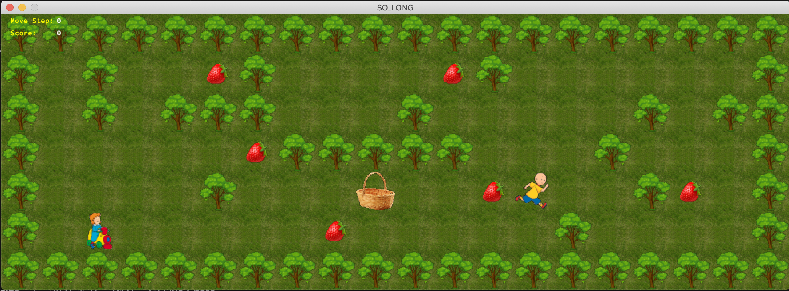
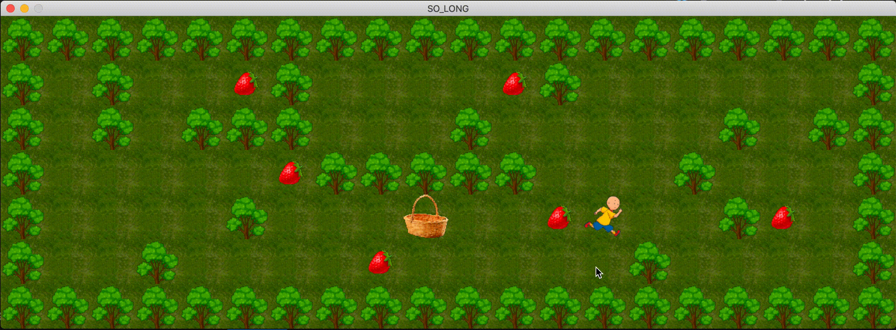

 

# So_Long 
 

## About the project
The objective of this project is to create a small 2D game where the player has to collect all the collectibles and go to the exit.
 

## GAME RULES
<ul>
  <li>The game we choose must follow a set of rules. The executable so_long will receive a map as the only argument, and this map will have a .ber filetype.</li>
  <li>Only P (character), 1 (wall), 0 (ground), C (collectible), and E (exit) will be accepted characters in our map.</li>
  <li>The map must be rectangular, i.e. all rows must have the same length</li>
  <li>There must be at least one exit, one player, and one collectible on the map</li>
  <li>The map must be closed, i.e. surrounded by walls</li>
  <li>If any of these checks fail, the game must end with Error\n followed by a custom message.</li>
  <li>The goal is for the player(s) to collect all the collectibles on the map before going to an exit in the least possible number of steps</li>
</ul>
 

## Installing and running the project
Clone this repository:
  `git clone https://github.com/whymami/so_long.git`
 

## Compilation
To compile the project, run the following command
  `make`
Run the following command to compile the bonus part
  `make bonus`
 

## Usage
  To start the game, `./so_long maps/map2.ber`
#### If you compiled the bonus part
  `./so_long_bonus maps/map_bonus/map2.ber`
 

## Structure of the map
| Character | Description|
|--|--|
| `0` | Ground |
| `1` | Wall |
| `P` | Player |
| `E` | Exit |
| `C` | Collectable |
| `X` | Villain |
 

## Controls

| Keyboard | Action |
|---|---|
| <kbd>W</kbd>| Moving Up |
| <kbd>S</kbd>| Moving Down |
| <kbd>A</kbd>| Moving left |
| <kbd>D</kbd>| Moving right |
| <kbd>ESC</kbd>, `⎋`| Close the game |
 

## Images:
#### Mandatory part

 

#### Bonus:

